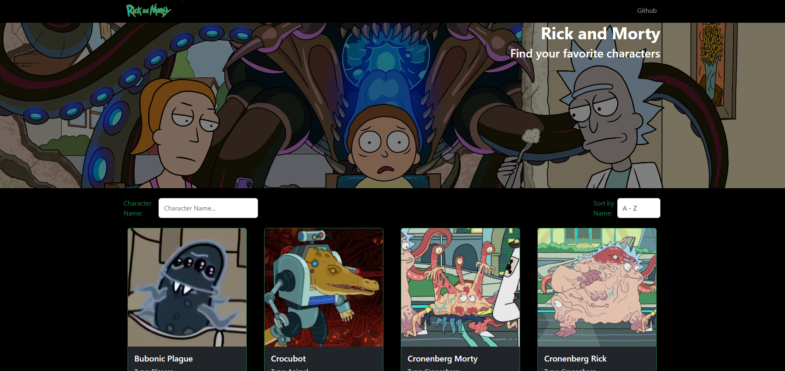

# Módulo 4 REACT I - Desafío 4 - Consumo API - React + Vite

## Presentación Página Web

##  

 

## Descripción del PY ⌨️

El proyecto muestra como se realiza el consumo de la Api de Rick and Morti, mostrando los personajes de la serie en diferentes páginas.
Además se agrega la opción de filtro de nombre y de orden alfabético.

El enlace de la api es el siguiente: https://rickandmortyapi.com/api/character

## Tecnologías Usadas 🛠️

- **HTML** 💀
- **CSS** 🎆
- **JS** 🧑‍💻
- **REACT JS** 👌
- **React-Bootstrap** 📚

 

---

 

## Autor 👨‍💻

**Desarrollador FullStack G-60 - Daniel Hernández T.⚡**
